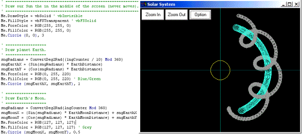

## A Simple Solar System Simulator, v1\.0

### Description

This Solar System Simulator is a very simple application designed to teach you how to rotate/animate planets around a sun, but also how to rotate moons around their planets. I have also implemented a very simple yet effective zoom functionality simply by changing the form's scale settings.

The position, timing and distances are not to scale. You will need to change these if you want an accurate system, however everything is commented so it should be no problem.
 
### More Info
 

             |
---                |---
**Submitted On**   |2003-08-25 10:19:02
**By**             |[Peter Wilson](https://github.com/Planet-Source-Code/PSCIndex/blob/master/ByAuthor/peter-wilson.md)
**Level**          |Beginner
**User Rating**    |4.6 (23 globes from 5 users)
**Compatibility**  |VB 6\.0
**Category**       |[Internet/ HTML](https://github.com/Planet-Source-Code/PSCIndex/blob/master/ByCategory/internet-html__1-34.md)
**World**          |[Visual Basic](https://github.com/Planet-Source-Code/PSCIndex/blob/master/ByWorld/visual-basic.md)
**Archive File**   |[A\_Simple\_S1635128252003\.zip](https://github.com/Planet-Source-Code/peter-wilson-a-simple-solar-system-simulator-v1-0__1-47973/archive/master.zip)

